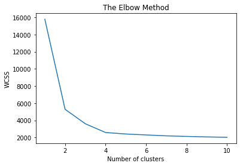

# Student-Clustering
 --------------------------
 
● This project Clusters the students into different groups on the basis of features fed to our model. 
● Features include Scholar_Id, Gender, Monthly Expenditure, Mother tongue, Hobbies, Ambitions, Music genres,
Addictions, etc. 
● K- Means and DBSCAN Clustering techniques are used to cluster the students.. 

 *****Result Obtained After DBSCAN****** 

Estimated number of clusters: 3\
Estimated number of noise points: 70\
Homogeneity: 0.788\
Completeness: 0.627\
V-measure: 0.698\
Adjusted Rand Index: 0.658\
Adjusted Mutual Information: 0.624\
Silhouette Coefficient: 0.435

---------

 *****Result Obtained After K-Means Clustering******
 
 
 
 
